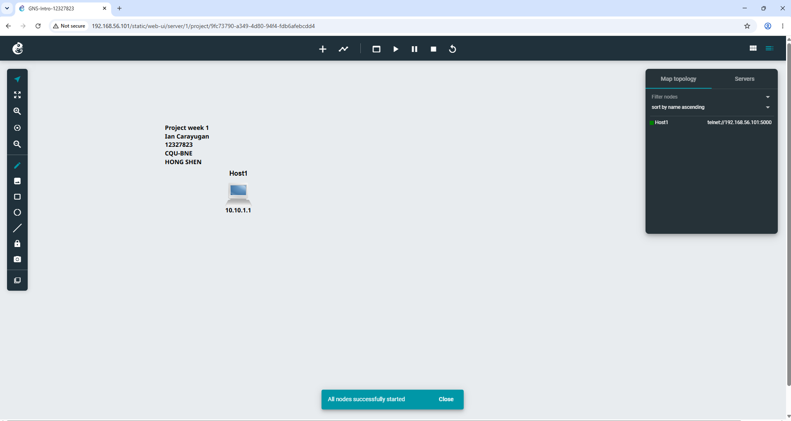
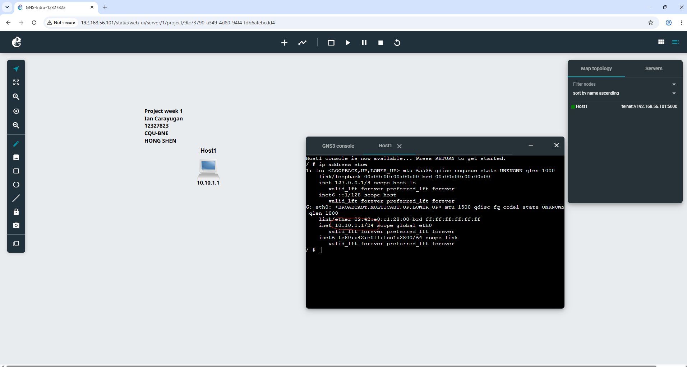
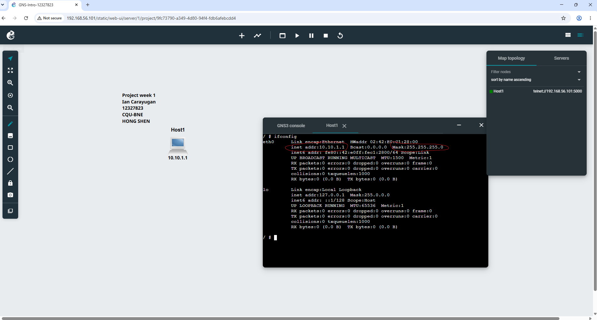

# Week 01 Tutorial — Introduction to GNS3 Basics

## Task 1: Introduction to GNS3 Basics

### 1. Project Setup
Created a new project in GNS3.

### 2. Adding a Linux Host Node
Added a Linux Host node to the topology and labeled it with student information.

### 3. IP Address Assignment
Assigned IP address `10.10.1.1` to the node and added a text label near the host to document the configuration.

### 4. Starting the Node
Started the node successfully.

### 5. Testing via Web Console
Verified the configuration using command-line tools in the web console.

## Reflection

I had my first practical encounter with GNS3 and GitHub repository administration during this lab session. Using GitHub to record the weekly lab activities gave me a structured way to log the steps I took, along with relevant screenshots and explanations to demonstrate my understanding of each task. Even though the exercises were relatively simple, they highlighted how important it is to assign IP addresses correctly and use command-line tools to verify network configurations.
