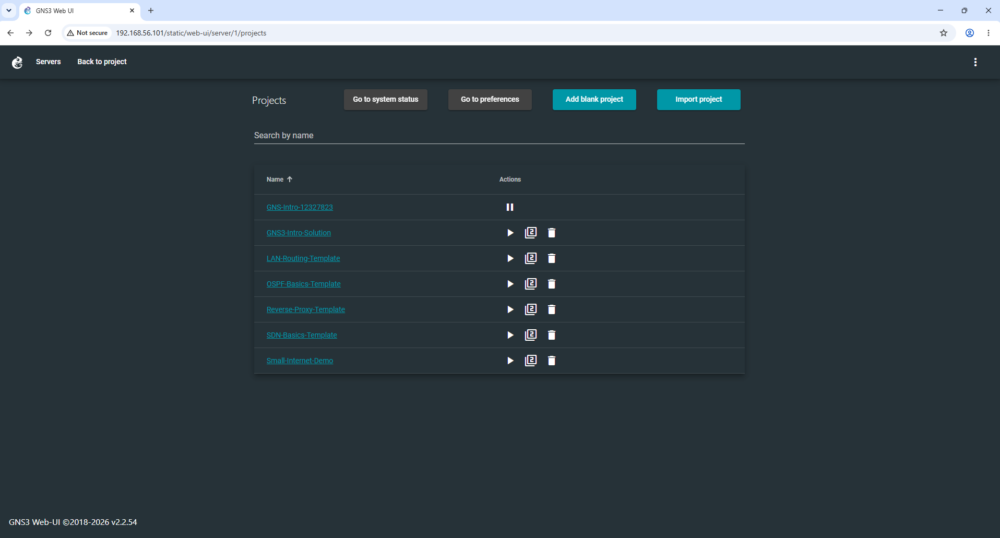
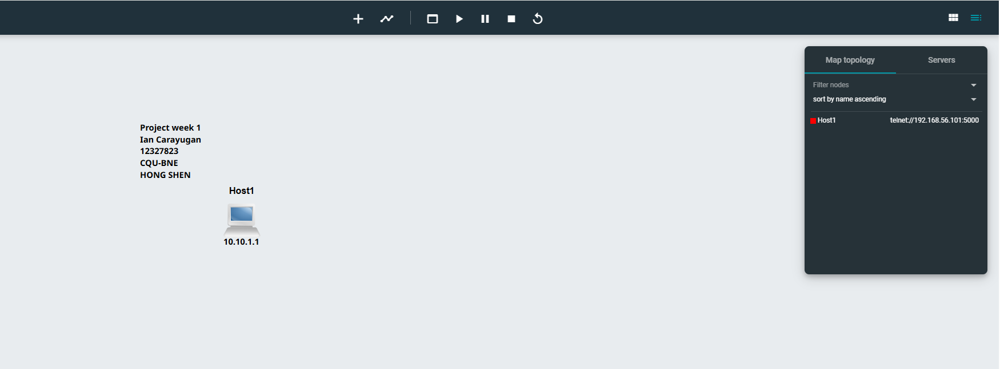
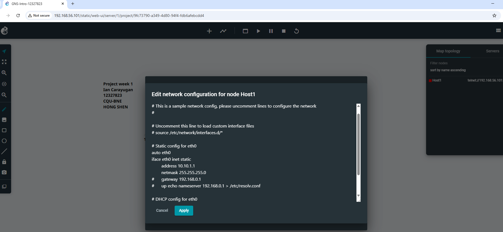

Week 01 Tutorial
Task 1: Introduction to GNS3 Basics

Added a new Project

Added a Linux Host node and Added text showing student information

Use IP Address 10.10.1.1 to the node also added text in near the host
   
Node successfully Started

Reflection
I had my first practical encounter with GNS3 and GitHub repository administration during this lab session. Using GitHub to record the weekly lab activities gave me a structured way to record the steps I took, along with pertinent screenshots and explanations to show that I understood each work. Even though the exercises were somewhat simple, they emphasized how crucial it is to assign IP addresses correctly and use command-line tools to verify network configurations.
