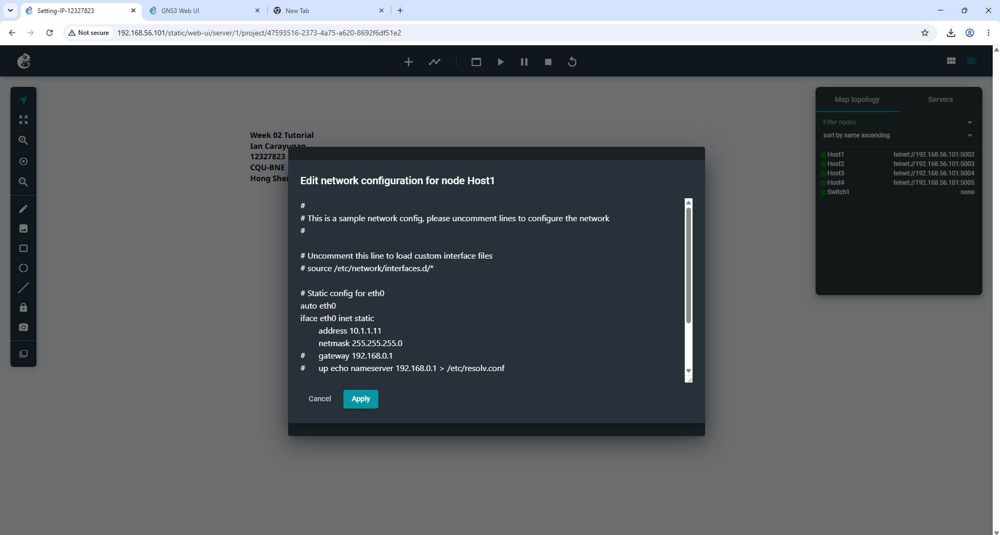
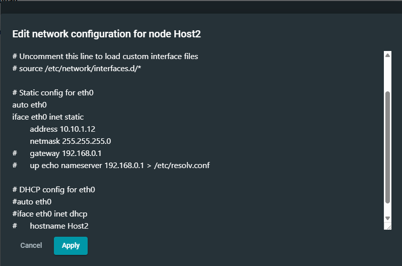
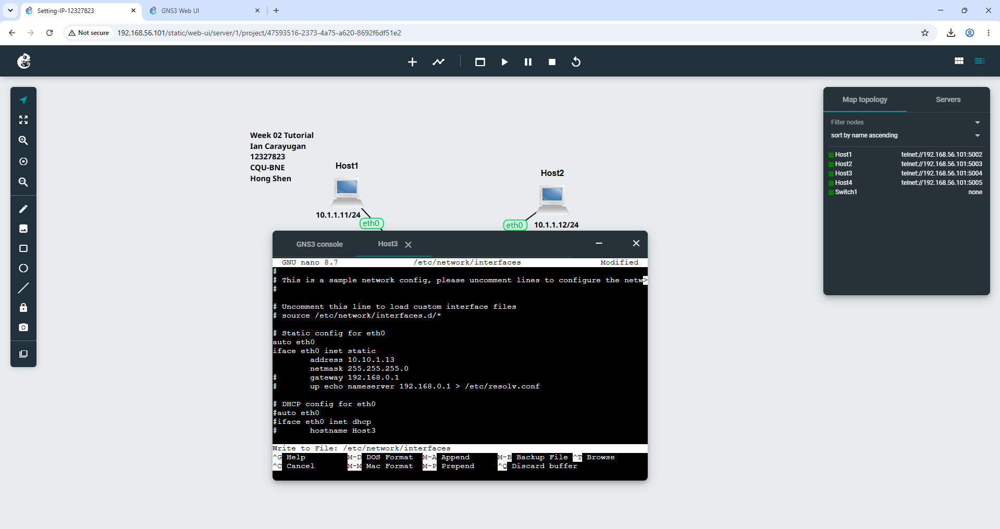
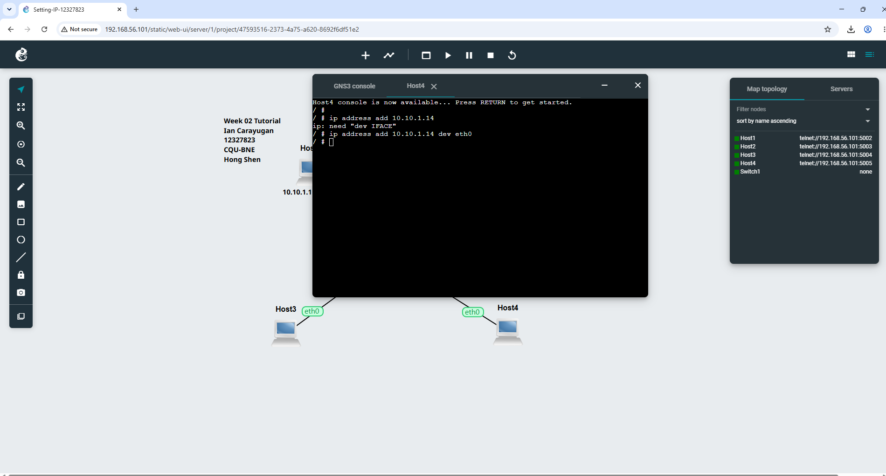
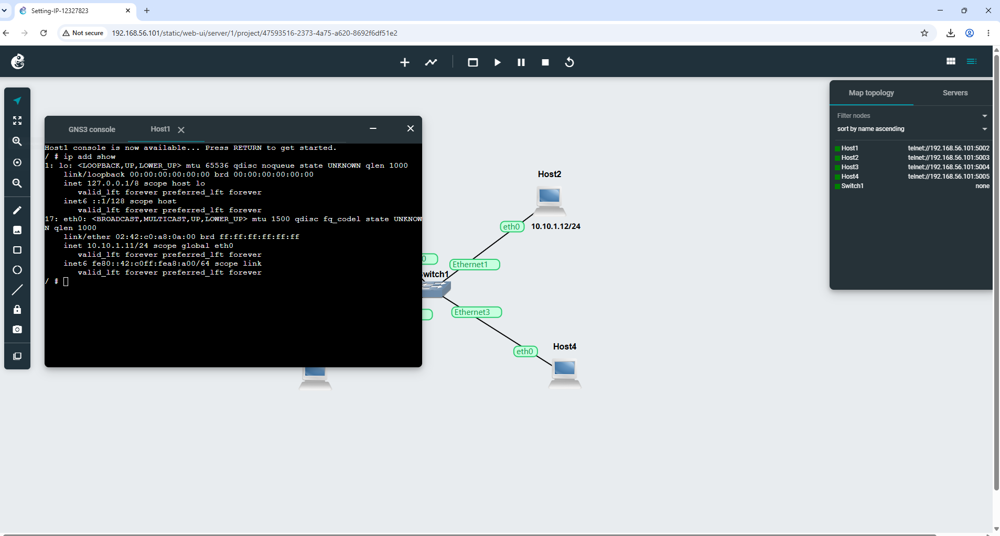
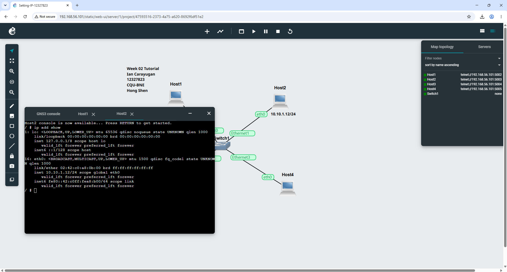
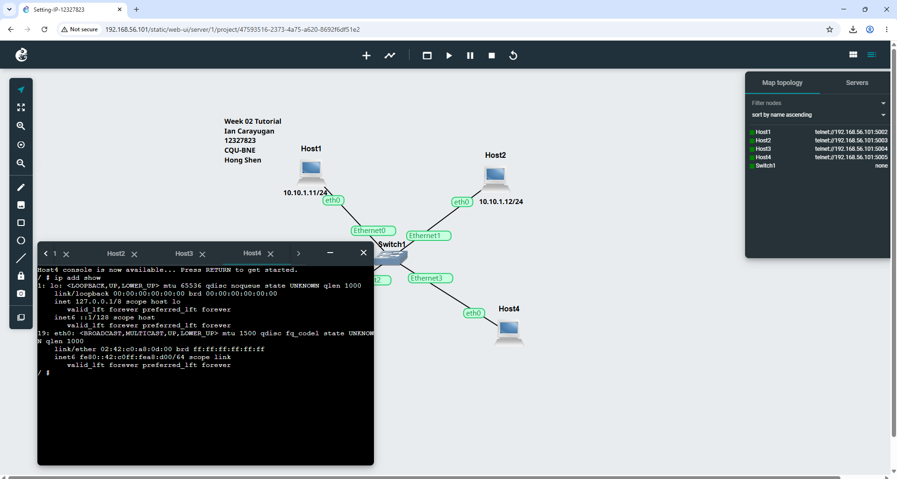
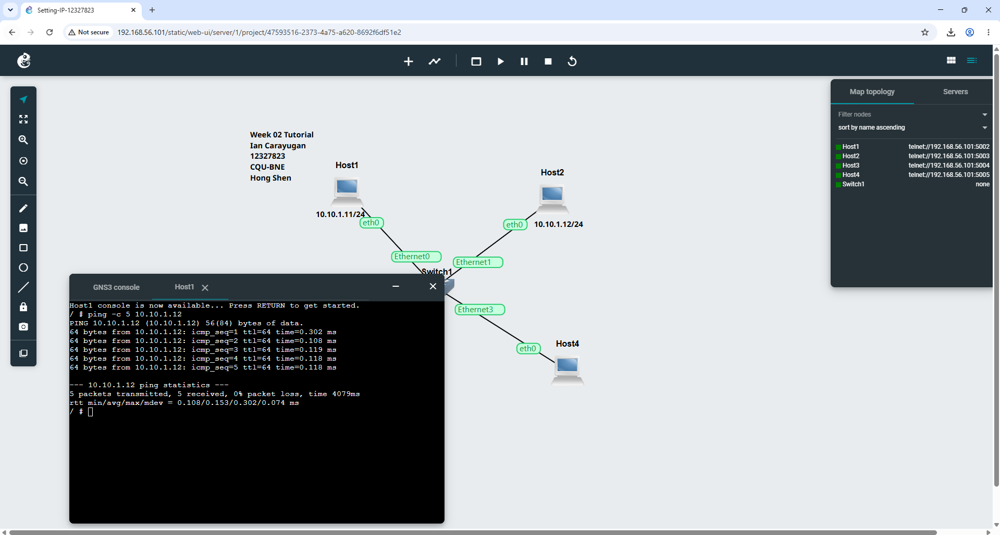
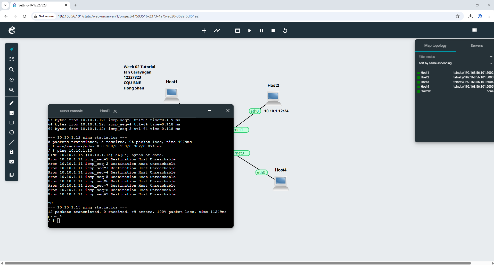

# Week 02 Tutorial

## 1. Project Setup
Created a new project named **Setting-IP-12327823**.

## 2. Network Topology
Added four Linux Host nodes and one Ethernet switch, then connected them together to form a LAN.

## 3. IP Address Configuration

### Host 1 & Host 2
Configured IPv4 addresses starting at `10.10.1.11` for Host 1 and Host 2.

Host 3 and Host 4 were left without the configure option applied at this stage. All nodes were then started.

### Host 3 — Static IP via Config File
Used `nano /etc/network/interfaces` on Host 3 to manually configure a static IP address of `10.10.1.13`.

### Host 4 — Static IP via Command
Used the `ip address add` command on Host 4 to assign an IP address to the host.

## 4. Verifying IP Addresses
Confirmed that all IP addresses were correctly assigned across the four hosts.

## 5. Ping Tests

**Pinging Host 2** — successful reply confirming connectivity:

**Pinging a random IP not included in the host configuration** — expected failure:

