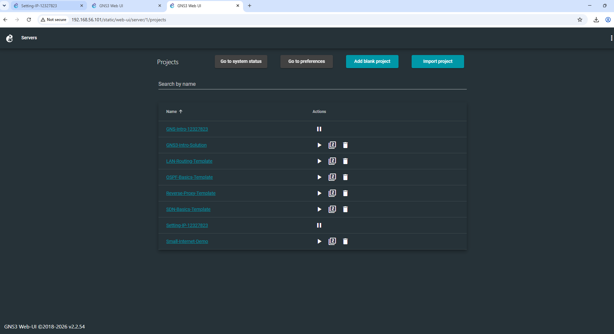
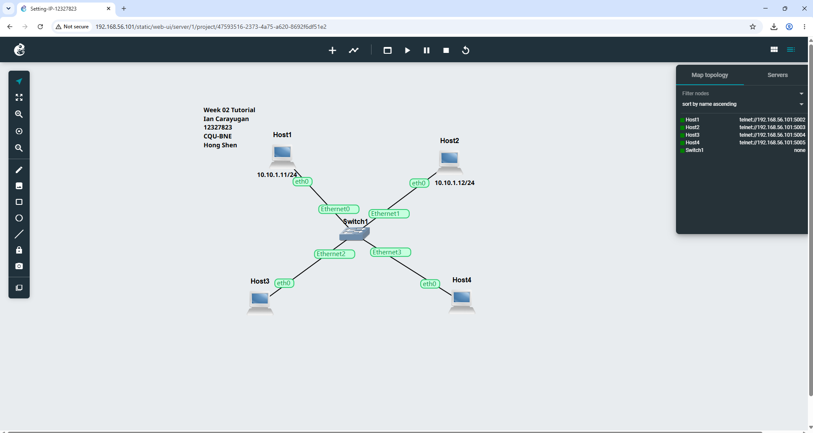

Week 02 Tutorial

Created a project named Setting-IP-12327823

Added four 4 nodes of type Linux Host and one Ethernet switch, and connect together into a LAN

Select an IPv4 network address uses 10.10.1.11 

Did not apply the configure option to the two host which is host 3 and 4
Start all nodes.

Uses nano/etc/network/interface in the 3rd host to be able to configure the static IP which is 10.10.1.13

On host 4 I did a IP address add command to be able to add a IP address to the host

All IP address are shown in the screenshot
