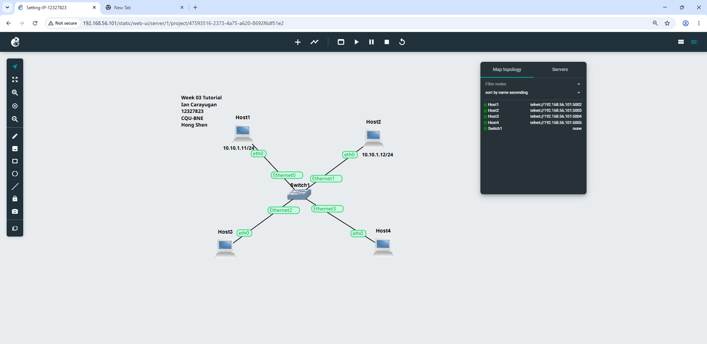
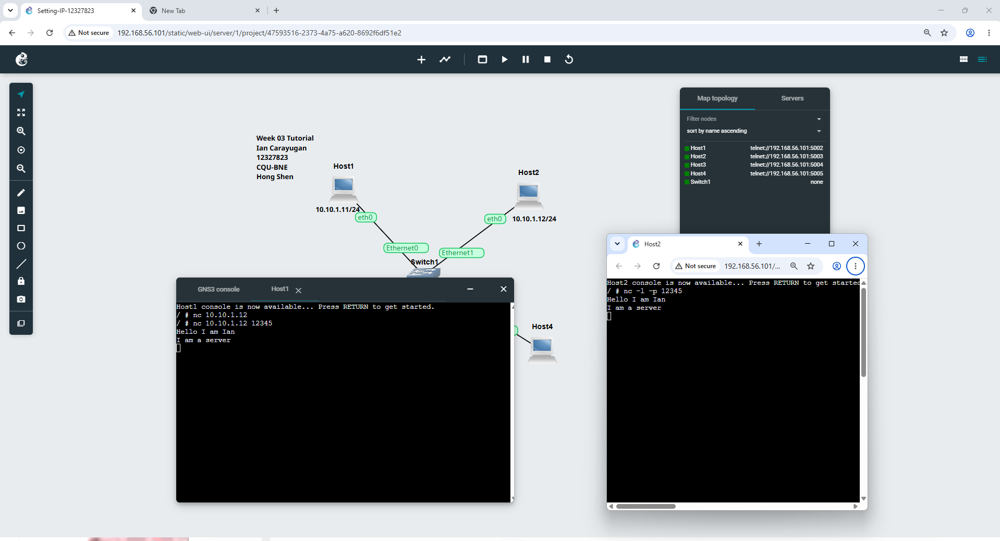

# Week 03 Tutorial

 Network setup
 The screenshot shows four Linux hosts connected through one Ethernet switch.
 Confirm each host has an IP address before starting Netcat.
 Week 03 Task 1 then requires one host to act as the Netcat server and another as the client
## Step 1

## Step 2

 Netcat communication
 The topology is ready for client/server testing.
 The terminal windows demonstrate the Netcat connection and message exchange.

## Step 3

