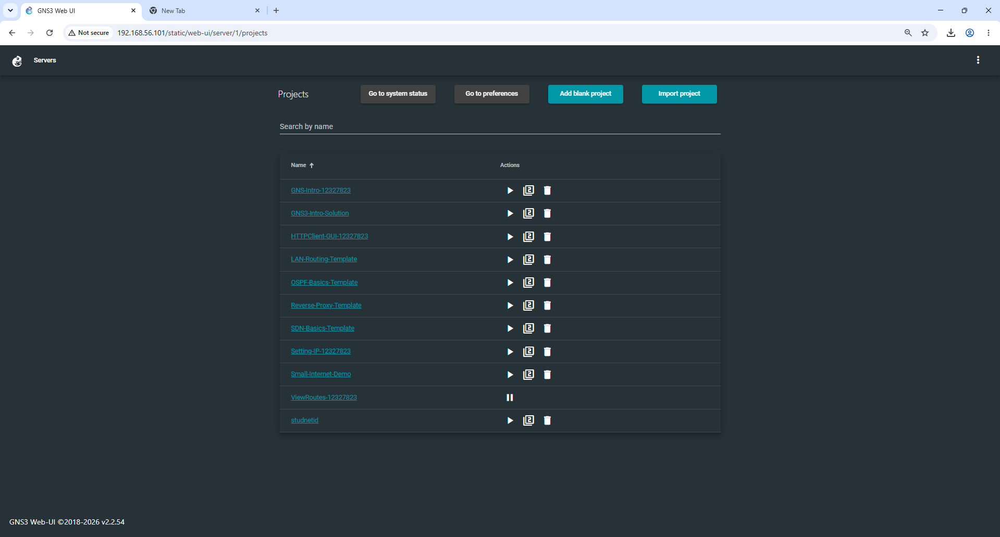
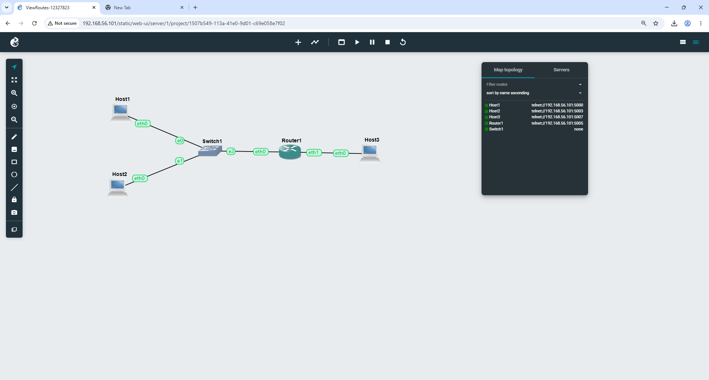
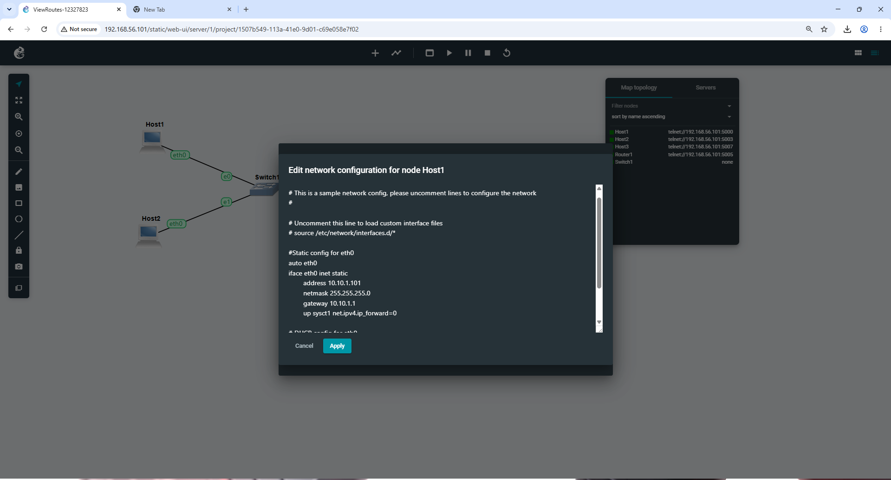
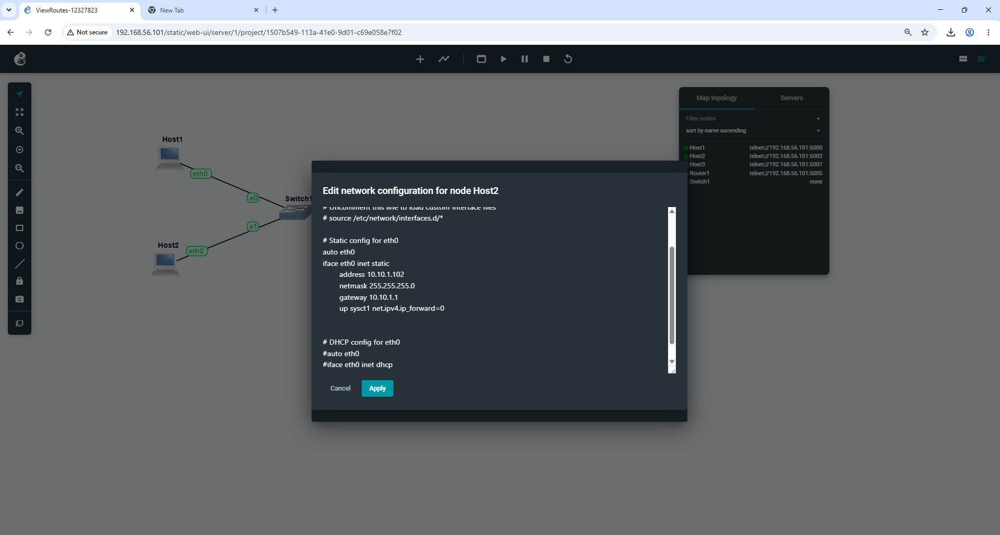
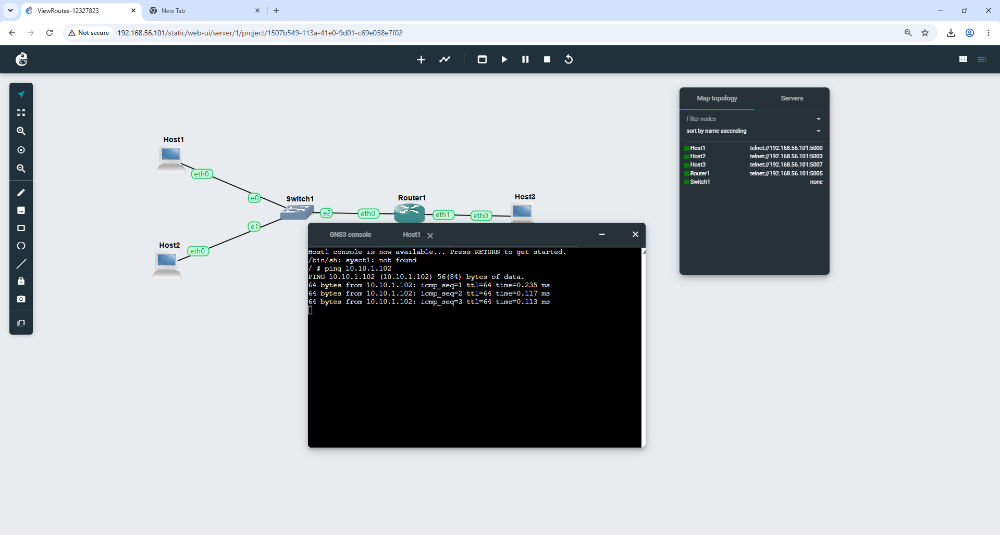
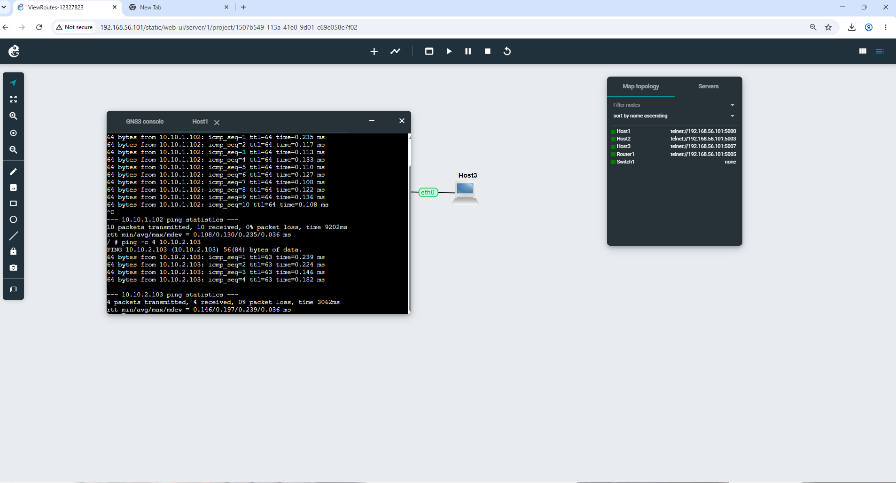
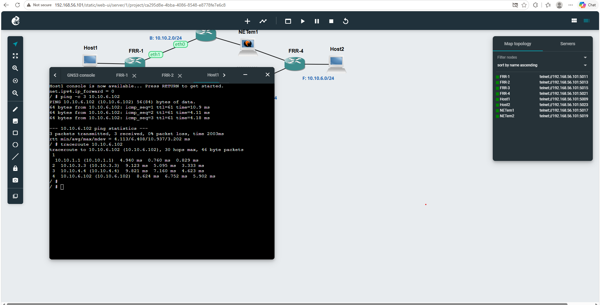

Week05 Tutorial

View-Routes-12327823

2 Linux Host to Linux router to switch to Linux host

All nodes Started

All routing in each device

Network test with ping

Dynamic Routing with OSPF

Import the project and Start all the nodes

Use the three FRR show ip commands 

Traceroute 

